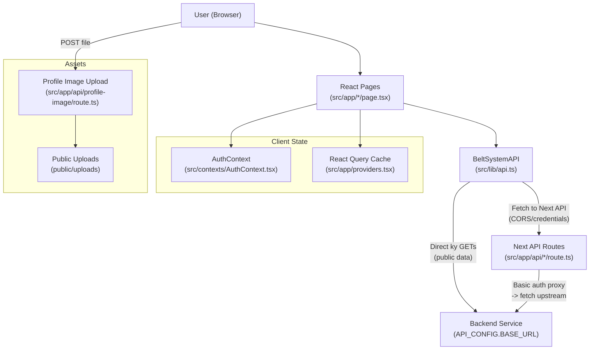
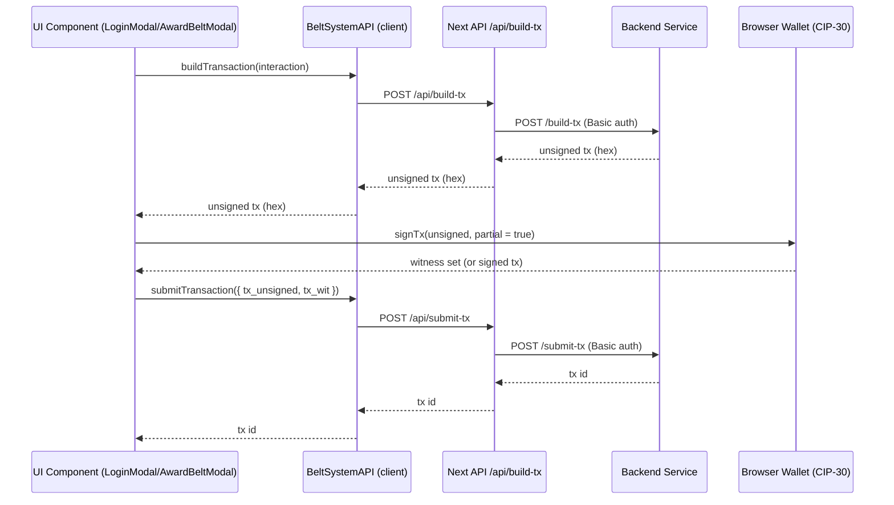

## High-level Architecture

This app is a full-stack Next.js application. The UI (React) runs in the browser, while simple server endpoints run inside Next.js API routes. Many data calls are proxied through those API routes to a separate backend service.

### Request/Data Flow

Key points:

- React pages/components call typed functions in `src/lib/api.ts`.
- Some functions call the Next API routes to keep credentials on the server and avoid CORS issues (e.g., building/submitting Cardano transactions, practitioner/org profile lookups).
- Next API routes proxy requests to the upstream backend defined by `API_CONFIG.BASE_URL` with Basic auth.
- Off-chain profile metadata and images are handled by Next API routes:
  - `profile-metadata` persists to SQLite (or memory fallback)
  - `profile-image` resizes and stores images under `public/uploads`

### Cardano Transaction Flow

Notes:

- The “interaction” object carries the action (e.g., create profile, promote profile) plus user addresses.
- Wallets sometimes return a full signed transaction instead of a witness set; components extract the witness set when needed before submission.

### Where to Find Things

- UI pages: `src/app/*/page.tsx`
- Reusable components: `src/components/*`
- Data access layer: `src/lib/api.ts`
- Global config: `src/config/api.ts`
- Auth/global state: `src/contexts/AuthContext.tsx`
- Next API routes (server): `src/app/api/**/route.ts`
- Types: `src/types/api.ts`

